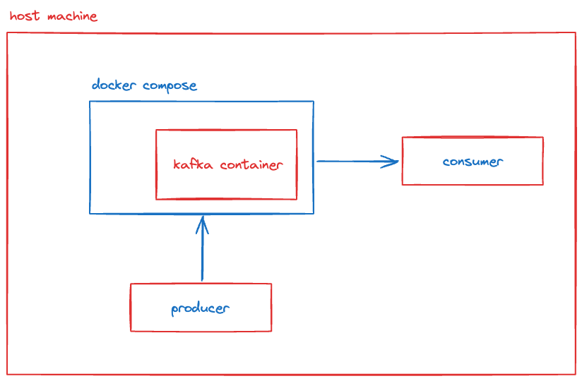

## Kafka tutorial with go

## Description
This tutorial setup Kafka with docker. 
This tutorial use `bitnami/kafka` dockerhub image, and consists of single broker.



## Getting Started

1. Run the following command to run kafka container with docker compose.
```
$ docker compose up
```

2. Run the following command to create a topic.
```
$ go run kafka-topic-generator.go
```

3. Make a seperate terminal tab, and run the following command to run consumer program. This program watch for events of "topic-A".
```
$ go run kafka-consumer.go
```

4. Make a seperate terminal tab, and run the following command to run producer program. This program produce three events of "topic-A". 
```
$ go run kafka-producer.go
```